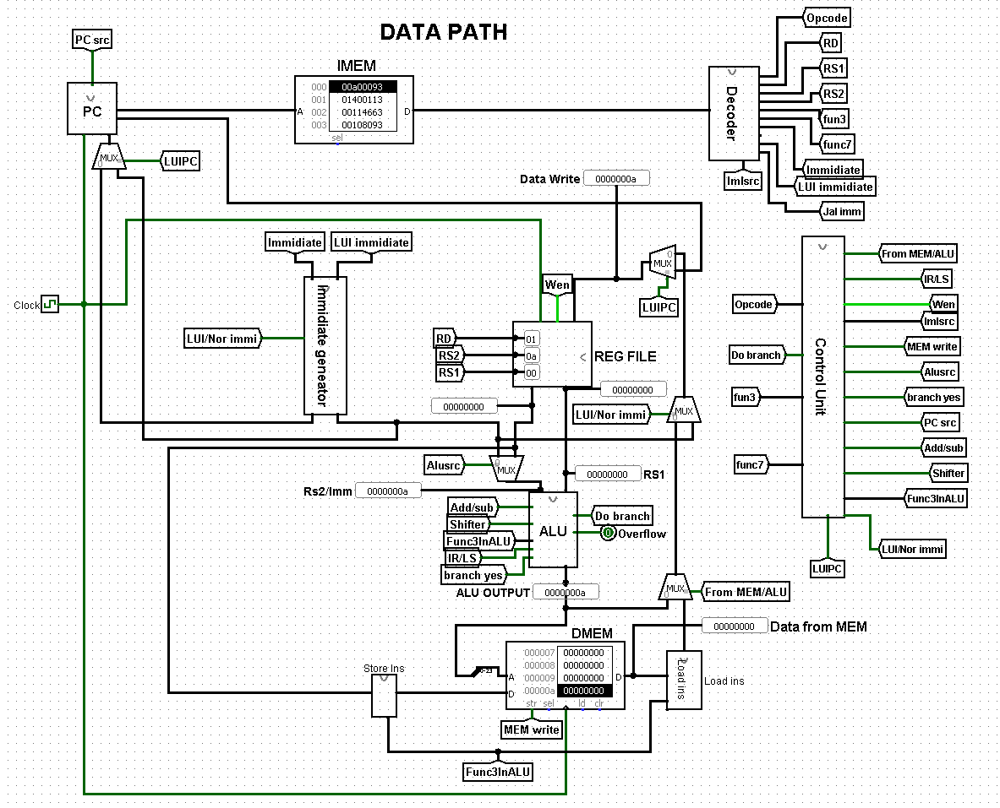

# RV32I Datapath with Instructions - Logisim

## Introduction

This GitHub repository contains an RV32I Datapath built using Logisim, a popular digital circuit design and simulation tool. The RV32I architecture is a 32-bit RISC-V base integer instruction set that is widely used in computer architecture education, embedded systems, and microcontroller design. This datapath design has been tested and verified using a complete iterative **Fibonacci(5)** sequence program with branch, arithmetic, and loop control execution.

## Datapath Overview



---

## Table of Contents

1. [Datapath Overview](#datapath-overview)
2. [Project Structure](#project-structure)
3. [Tested Program: Fibonacci(5)](#tested-program-fibonacci5)
4. [Getting Started](#getting-started)
5. [Using the Datapath](#using-the-datapath)
6. [Understanding the Datapath](#understanding-the-datapath)
7. [Contributing](#contributing)
8. [License](#license)

---

## Project Structure

The project structure is organized as follows:

- Rv32I_datapath is the Logisim project file and associated subcircuits (ALU, Control Unit, Register File, Immediate Generator, etc.).
- `pics/`: Contains datapath diagrams and visual assets (`datapath.png`).

---

## Tested Program: Fibonacci(5)

The RV32I datapath is fully tested and verified by running an iterative **Fibonacci(5)** computation program.

- **Expected Result:** `5` (stored in register `a1` / `x11`)
- **Input:** `a0 = N = 5`

### RISC-V Assembly Code

```assembly
# Fibonacci(5)
# Expected result: 5
#
# a0 = N = 5
# a1 = result

addi a0, zero, 5       # N = 5

addi t0, zero, 0       # previous = 0
addi t1, zero, 1       # current  = 1
addi t2, zero, 0       # i = 0

loop:
    beq  t2, a0, done  # if i == 5, finish

    add  t3, t0, t1    # next = previous + current
    add  t0, t1, zero  # previous = current
    add  t1, t3, zero  # current = next

    addi t2, t2, 1     # i = i + 1

    beq  zero, zero, loop   # unconditional branch

done:
    add  a1, t0, zero  # a1 = 5
```

### Instruction Breakdown

| Byte Offset | Machine Code (Hex) | Basic Code          | Original Assembly Code   | Description                                                  |
| :---------- | :----------------- | :------------------ | :----------------------- | :----------------------------------------------------------- |
| `0x00`    | `0x00500513`     | `addi x10, x0, 5` | `addi a0, zero, 5`     | Set$N = 5$ in register `a0` (`x10`)                    |
| `0x04`    | `0x00000293`     | `addi x5, x0, 0`  | `addi t0, zero, 0`     | Initialize`previous = 0` in register `t0` (`x5`)       |
| `0x08`    | `0x00100313`     | `addi x6, x0, 1`  | `addi t1, zero, 1`     | Initialize`current = 1` in register `t1` (`x6`)        |
| `0x0C`    | `0x00000393`     | `addi x7, x0, 0`  | `addi t2, zero, 0`     | Initialize loop counter`i = 0` in register `t2` (`x7`) |
| `0x10`    | `0x00a38c63`     | `beq x7, x10, 24` | `beq t2, a0, done`     | Branch to`done` (+24 bytes) if `i == N`                  |
| `0x14`    | `0x00628e33`     | `add x28, x5, x6` | `add t3, t0, t1`       | Compute`next = previous + current` in `t3` (`x28`)     |
| `0x18`    | `0x000302b3`     | `add x5, x6, x0`  | `add t0, t1, zero`     | Update`previous = current`                                 |
| `0x1C`    | `0x000e0333`     | `add x6, x28, x0` | `add t1, t3, zero`     | Update`current = next`                                     |
| `0x20`    | `0x00138393`     | `addi x7, x7, 1`  | `addi t2, t2, 1`       | Increment counter`i = i + 1`                               |
| `0x24`    | `0xfe0006e3`     | `beq x0, x0, -20` | `beq zero, zero, loop` | Unconditional jump back to`loop` (-20 bytes)               |
| `0x28`    | `0x000285b3`     | `add x11, x5, x0` | `add a1, t0, zero`     | Store final result (`5`) in `a1` (`x11`)               |

### Raw Hex Code (For Logisim RAM / Instruction Memory)

```hex
00500513
00000293
00100313
00000393
00a38c63
00628e33
000302b3
000e0333
00138393
fe0006e3
000285b3
```

---

## Getting Started

To get started with this RV32I Datapath project:

1. **Clone the Repository**:

   ```bash
   git clone https://github.com/your-username/RISC-V-RV32i-Datapath.git
   ```
2. **Open in Logisim**:

   - Launch Logisim (or Logisim-Evolution).
   - Open the circuit file located at `Src/HSGPRO400.circ`.
3. **Simulate the Datapath**:

   - Load the raw hex instructions into the Instruction Memory / ROM component.
   - Use Logisim's tick / step controls (`Ctrl+T` or manual clock) to observe instruction flow, register updates, and branch control logic.

---

## Using the Datapath

1. **Load Instructions**: Right-click the Instruction Memory / ROM component in Logisim, select **Edit Contents**, and paste the hex machine codes.
2. **Run the Simulation**: Enable clock ticks or manually step through cycles to observe the program counter (PC), control signals, ALU operation, and data flow.
3. **Inspect Registers**: Open the Register File component to monitor `a0` (`x10`), `t0` (`x5`), `t1` (`x6`), `t2` (`x7`), `t3` (`x28`), and `a1` (`x11`) updating on each clock cycle.
4. **Analyze Branching**: Observe the branch comparator logic calculating branch decisions and updating the PC with the branch target offset.

---

## Understanding the Datapath

To gain a deeper understanding of the RV32I datapath:

- Explore the subcircuits inside `Src/HSGPRO400.circ` (Control Unit, ALU, Register File, Data Memory).
- Test edge cases by modifying $N$ in `addi a0, zero, <N>` to compute other Fibonacci numbers.

---

## Contributing

Contributions to this project are welcome! If you have improvements, bug fixes, or additional instruction support:

1. Fork the repository.
2. Create a feature branch (`git checkout -b feature/new-instruction`).
3. Commit your changes and test thoroughly in Logisim.
4. Submit a Pull Request.

---

## License

Distributed under the MIT License. See `LICENSE` for more information if applicable.
